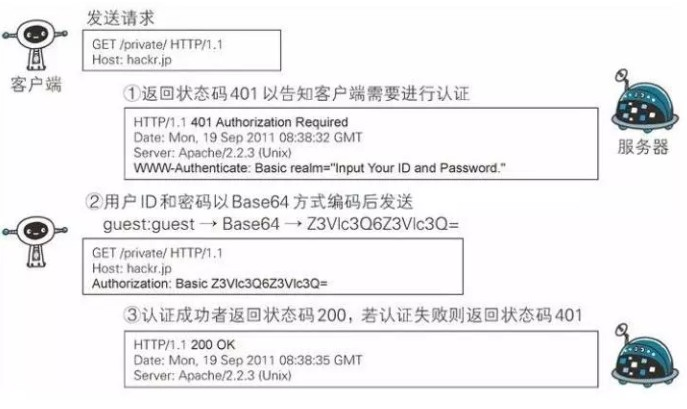
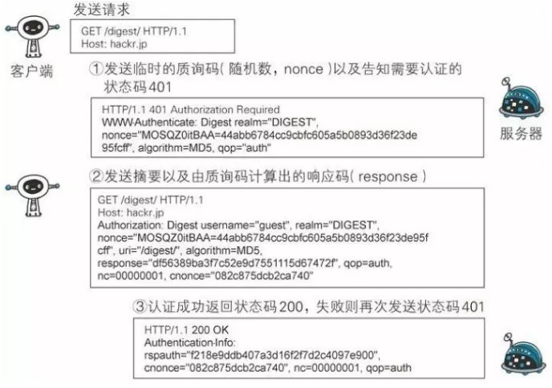

# HTTP协议说明

## 1.报文结构
### 1.1 请求报文

    请求方法 空格 URL 空格 协议版本 回车换行
    头部字段名 : 值 回车换行
        ...
    头部字段名 : 值 回车换行
    回车换行
    数据报文

示例
``` http
POST http://localhost HTTP/1.1
Content-Type:text/html;charset=utf-8
Accept: image/gif, image/x-xbitmap
Cookie: PREF=ID=80a06da87be9ae3c:NW=1:S=ybYcq2wpfefs4V9g;

hl=zh-CN&source=hp&q=domety
```
### 1.2 响应报文
    协议版本 空格 状态码 空格 状态描述 回车换行
    头部字段名 : 值 回车换行
        ...
    头部字段名 : 值 回车换行
    回车换行
    数据报文
    
示例
``` http
HTTP/1.1 200 OK
Date: Sat, 31 Dec 2005 23:59:59 GMT
Content-Type: text/html;charset=ISO-8859-1
Content-Length: 122

<html>
<head>
<title>Wrox Homepage</title>
</head>
<body>
<!-- body goes here -->
</body>
</html>
```

## 2.认证方式
### 2.1 Basic认证(基本认证)


    >>发送请求
    <<返回状态码401 要求客户端提供认证信息
    >>用户名和密码以BASE64方式编码发送
    <<认证成功返回 200 OK 否则 401继续认证
### 2.2 Digest(摘要认证)


1. 请求需认证的资源时，服务器会随着状态码 401 Authorization Required，返回带 WWW-Authenticate 首部字段的响应。该字段内包含质问响应方式认证所需的临时质询码(随机数，nonce)。

* 首部字段 WWW-Authenticate 内必须包含 realm 和 nonce 这两个字段的信息，客户端就是依靠向服务器回送这两个值进行认证的。
* nonce 是一种每次随返回的 401 响应生成的任意随机字符串。该字符串通常推荐由 Base64 编码的十六进制数的组成形式，但实际内容依赖服务器的具体实现。

2. 接收到 401 状态码的客户端，返回的响应中包含 DIGEST 认证必须的首部字段 Authorization 信息。

* 首部字段 Authorization 内必须包含 username、realm、nonce、uri 和 response 的字段信息。其中，realm 和 nonce 就是之前从服务器接收到的响应中的字段。
* username 是 realm 限定范围内可进行认证的用户名。
* uri(digest-uri)即 Request-URI 的值，但考虑到经代理转发后 Request-URI 的值可能被修改，因此事先会复制一份副本保存在 uri 内。
* response 也可叫做 Request-Digest，存放经过 MD5 运算后的密码字符串，形成响应码。


3. 接收到包含首部字段 Authorization 请求的服务器，会确认认证信息的正确性。认证通过后则返回包含 Request-URI 资源的响应。并且这时会在首部字段 Authentication-Info 写入一些认证成功的相关信息。

### 2.3 SSL认证